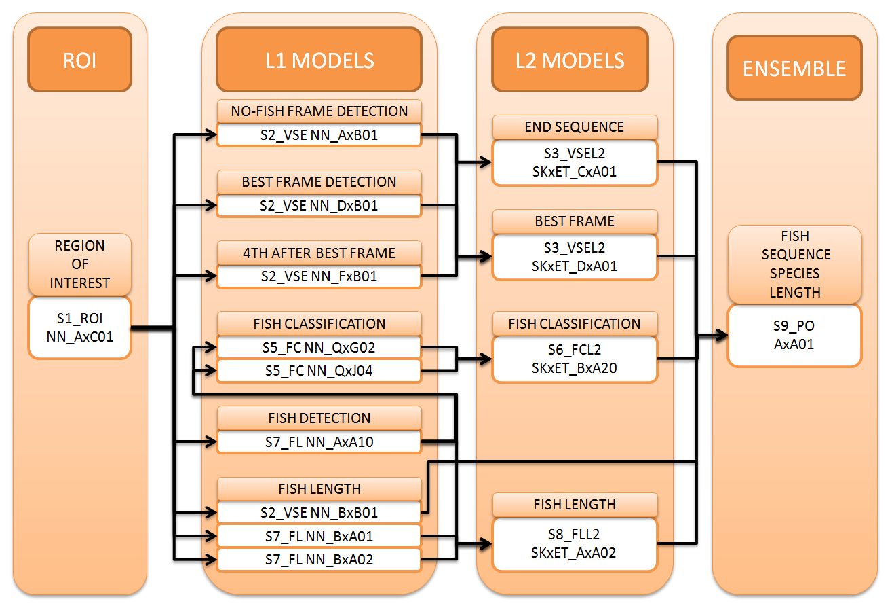

# N+1 fish, N+2 fish

>**3rd Place Solution for [N+1 fish, N+2 fish Competition ](https://www.drivendata.org/competitions/48/identify-fish-challenge/page/90/).**
>
>My final 3rd prize winning submission scored **0.7224** on Public LB and **0.7316** on Private LB. This is the code used to generate that submission.


## Dependencies
I used a intel i7 8 cores (16 threats) with 64Gb RAM + 64Gb swap memory, and the following configuration: 

* Platform: x86_64-pc-linux-gnu (64-bit)
* Running under: Ubuntu 14.04.4 LTS
* [Anaconda 4.3.16 (64-bit)](https://docs.continuum.io/anaconda/pkg-docs) and [python 2.7.12](https://www.python.org/downloads/release/python-2712/)

Neural Networks packages:

* [Keras 2.0.4](https://github.com/fchollet/keras/releases/tag/2.0.4)

  Configuration `keras.json`:
  
```
{"image_data_format": "channels_first",
  "epsilon": 1e-07, 
  "floatx": "float32", 
  "backend": "theano"}
```

* [Theano 0.9](https://pypi.python.org/pypi/Theano)

  Configuration `.theanorc`:
  
```
[global]
device = cuda
floatX = float32
```

* [PyTorch 0.1.12](http://pytorch.org/previous-versions/)
* [NVIDIA CUDA 8.0](https://developer.nvidia.com/cuda-downloads)
* [NVIDIA cuDNN v6](https://developer.nvidia.com/cuda-downloads)

Other packages:

* imageio==2.2.0
* matplotlib==2.0.1
* numpy==1.13.1
* pandas==0.19.2
* Pillow==4.1.1
* scikit-image==0.13.0
* scikit-learn==0.18.1
* scipy==0.19.1
* tqdm==4.11.2


## FlowChart
> Flow chart of models denomination and interdependencies:



## Instructions
> Download Data

Download data from the [competition website](https://www.drivendata.org/competitions/48/identify-fish-challenge/data/) and put all the data into folder `./L0_01_Data_RAW`. This folder must contain the following:

    .
    ├── ...
    ├── L0_01_Data_RAW                   # Raw data
    │   ├── test_videos                  # Test set videos
    │   ├── train_videos                 # Train set videos
    │   └── submission_format_zeros.csv  # The submission format for the competition
    │   └── training.csv                 # Training set annotations 
    └── ...

> K-Folds cross-validation

Make sure that the files containing train/test indices to split data in folds are in the correct location, as shown below. We use them for cross-validation and to train Layer 2 models stacking folds predictions.

    .
    ├── ...
    ├── L0_10_Preprocess                 # Pre-processed files
    │   ├── Kfolds_F2.csv.gz             # 2 Folds random splits
    │   └── Kfolds_Fs3.csv.gz            # 3 Folds Stratified splits
    └── ...

F2 is used in the first stage of training (S1) to detect the Region Of Interest (ROI). Fs3 is used in the rest of models. Splits are made such a way that they preserve the boats distribution and avoid very similar videos in different folds.

> Run Training

Run `./python train.py` to generate all the intermediate models and predictions. 

Some settings can be modified editing the file `./SETTINGS_exec.json`, like the max number of cores (threads) to use in calculations. Default folder names can be modified editing the file`./SETTINGS_path.json`. For both files we recommend to leave the default values.

All process has been done using CUDA, but shoud be woark as well using just the cpu cores. In `train.py` you can specify the cuda device (or cpu) to use (cuda, cuda0, cuda1, cpu, ...):

```python
theano_flags = 'THEANO_FLAGS=device=cuda'
```

In `train.py` there are comments indicating the execution time for each training stage. This time correspond to the execution of the code in a GTX 1070 gpu and 16 threads cpu. In this conditions, the total training time is 135 hours (5 days 15 hours).

Some files accept `--debug_mode` as argument when are executed. This option reduces dramatically the execution time of the code and could be used to debug dependencies or others. NEVER PASS THIS ARGUMENT TO THE FINAL TRAINING OR THE RESULTS WON'T BE THE DESIRED ONES.


> Generate Submission

Run `./python generate_submission.py` to generate the submission file. It will be saved in `./submissions`. It should take less than 10 minutes using 16 threads.

    .
    ├── ...
    ├── submissions
    │   └── submission_S9_PO_AxA01.csv  # Submission File
    └── ...


## Documentation

[Documentation](./doc/Model_writeup_v0.pdf) is located in `./doc`