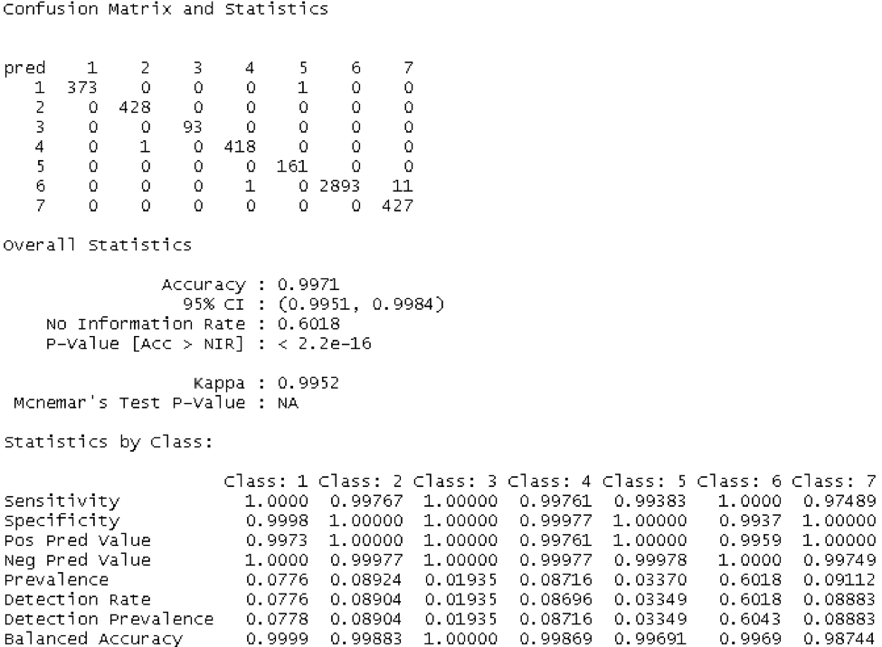
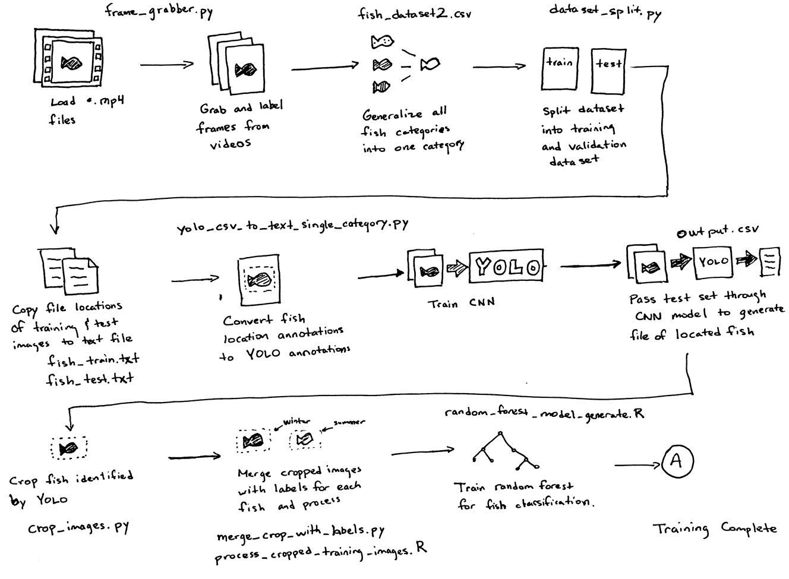
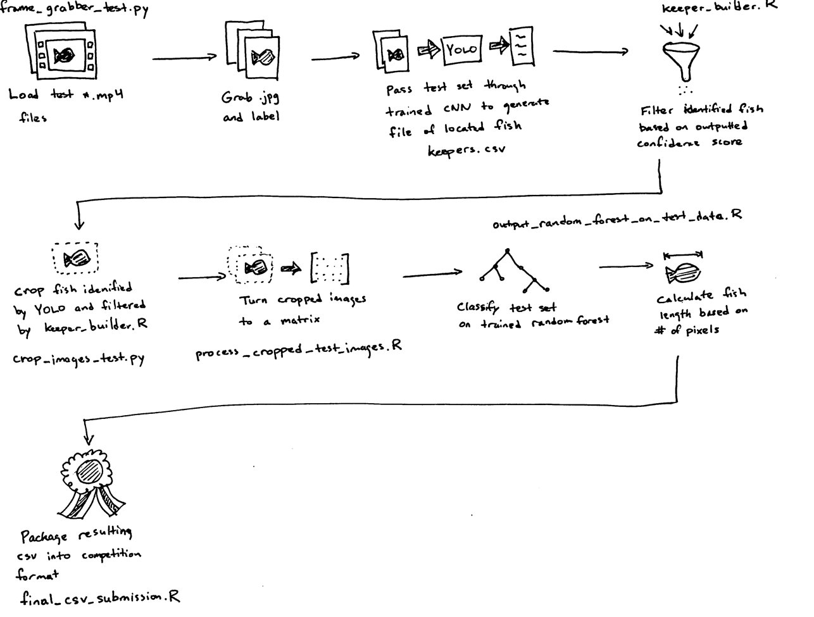

# N+1 fish, N+2 fish – Fish identification Approach

#### By Cecil Rivers

## 1. Introduction

The N+1 fish, N+2 fish competition was a data analysis competition focused on automating the video review of tracking fish captured by commercial fishing boats.  This competition was hosted by Driven Data and partnered with The Nature Conservancy and Gulf of Maine Research Institute.  By accurately counting all fish caught including those thrown back because they are the wrong size or species, this will increase the ability for fisheries to become sustainable.  In order to track fish better, fishing boats have been equipped with video cameras to monitor the activities of the fishing vessels.  In order to reduce the man-hours of reviewing the videos, the goal of this competition is to generate a program(s) that can automatically detect, measure and count the fish in each video feed.

## 2. Philosophy

The philosophy taken with the approach in this competition was to utilize open source and free tools.  Since the idea of video analysis and image processing is applicable to multiple applications, it would be ideal to utilize tools that can easily be accessed by a broader audience.  Python, YOLO and R were used for this approach.

## 3. Data

The N+1 fish, N+2 fish program provided two datasets, along with several accompanying files.  The first dataset is a training set that has 1332 videos in mp4 format.  Each training video has an accompanying json file where the following information can be found:

- row\_id - A is number for the row in the dataset.
- video\_id - The ID of the video. Videos appear in the folder as &lt;video\_id&gt;.mp4 and have individual annotations for use in the annotation software stored as &lt;video\_id&gt;.json
- frame - The number of the frame in the video. Note: not every video software/library encodes/decodes videos with the same assumptions about frames. You should double check that the library you use renders frames where these annotations line up with the fish.
- fish\_number - For a given video\_id, this is the Nth (e.g., 1st, 2nd, 3rd) fish that appears in the video.
- length - The length of the fish in pixels.
- x1 - The x coordinate of the first point on the fish.
- y1 - The y coordinate of the first point on the fish.
- x2 - The x coordinate of the second point of the fish.
- y2 - The y coordinate of the second point of the fish.
- species\_fourspot - 1 if the fish is a Fourspot Flounder
- species\_grey sole - 1 if the fish is a Grey Sole
- species\_other - 1 if the fish is one of a number of other species
- species\_plaice - 1 if the fish is a Plaice Flounder
- species\_summer - 1 if the fish is a Summer Flounder
- species\_windowpane - 1 if the fish a Windowpane Flounder
- species\_winter - 1 if the fish is a Winter Flounder

There is also a csv file which holds all the information found in the json files.  The second dataset are 667 test videos that the fish predictions need to be made on.  All the videos both datasets have a video size of 1280 x 720.

## 4. Predictions

The output of the competition must produce several items packaged into a single csv file for all of the test videos provided as shown below:

- row\_id - A row ID for the test set file.
- frame - The frame in the video.
- video\_id - The video ID for the video in the test set.
- fish\_number - For each video\_id, this should be incremented each time a new fish appears clearly on the ruler.
- length - The length of the fish in pixels.
- species\_fourspot - a probability between 0 and 1 that the fish is a Fourspot Flounder
- species\_grey sole - a probability between 0 and 1 that the fish is a Grey Sole
- species\_other - a probability between 0 and 1 that the fish belongs to a different species not explicitly tracked here
- species\_plaice - a probability between 0 and 1 that the fist is a Plaice Flounder
- species\_summer - a probability between 0 and 1 that the fist is a Summer Flounder
- species\_windowpane - a probability between 0 and 1 that the fist is a Windowpane Flounder
- species\_winter - a probability between 0 and 1 that the fist is a Winter Flounder

Each frame must be analyzed to determine if a fish is in the frame.  The species of the fish must be determined along with the length of the fish in pixels.  The program also track each time a new fish appears clearly on the measuring ruler in the frame.

## 5. Approach

There are several main steps to generate a model that can predict and track the fish.

### 5.1  Training

1. Frame Grabber: Grabs all the frames in each video and saves them as jpeg files
2. Generalize training csv file from various species to just a single fish
3. Split dataset into training and validation
4. Train YOLO
5. Pass test data through YOLO model and generate annotations for the detected fish
6. Crop training dataset images using identified annotations
7. Flatten the cropped image and place in a matrix for all cropped images
8. Add fish species for each cropped image
9. Generate random forest model from cropped images pixels with fish species

The main part of the training is YOLO.  YOLO is an object detection program that uses a single neural network on a full image.  The network divides the image into regions and predicts bounding boxes and probability for each region.  The bounding boxes are weighted by the predicted probabilities.  Since the training dataset has annotations around for each fish, YOLO is ideal because it utilizes the annotations during the training process.

Once the YOLO network is trained, a set of known test frames are passed through the model.  The output of the model is the probability of the objects detected above a set threshold and the bounding box of the image.  The bounding box associated with the maximum probability for each frame is kept.

Using the bounding boxes generated in the YOLO prediction, the frame images above a set prediction threshold are cropped.  The cropped images are merged with its associated species label.  The merged cropped images and labels are ready to be used to train a random forest.  The confusion matrix below shows high specificity and sensitivity generated by using a random forest on the cropped image data.

Class 1 – 7 are species fourspot flounder, grey sole, other fish, plaice flounder, summer flounder, windowpane flounder and winter flounder respectively.

### 5.2  Prediction

After the random forest model has been created, the test video dataset is ready to be evaluated.  Just like the training set, a similar set of frame capturing and cropping is performed.  Below are the highlights of the processing of the test dataset videos:

1. Frame Grabber: Grabs all the frames in each video and saves them as jpeg files
2. Pass test data through YOLO model and generate annotations for the detected fish
3. Crop test dataset images using identified annotations
4. Flatten the cropped image and place in a matrix for all cropped images
5. Pass the cropped images through the random forest model from the cropped images matrix to generate the probability of the fish species.
6. Calculate fish length using the cropped images&#39; dimensions

